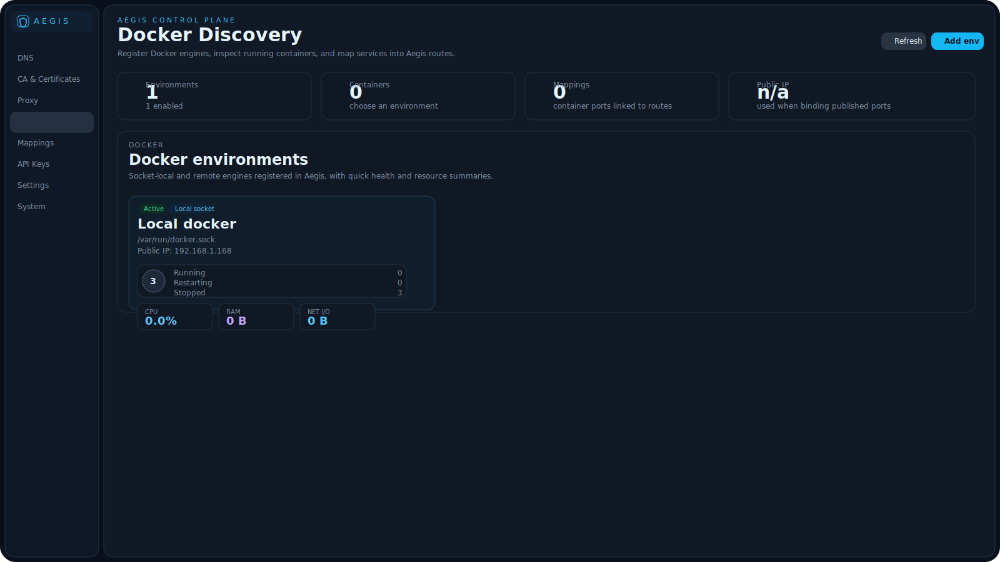

<p align="center">
  
</p>

<p align="center">
  A control plane for self-hosted LAN services that connects DNS, certificates, proxy routing, and Docker discovery into one workflow.
</p>

> [!WARNING]
> Aegis is under active development. It is not intended to be exposed directly to the public internet and should not be considered ready for critical or high-assurance environments. Parts of the project were code-vibed, so security hardening, edge-case handling, and operational guarantees are still evolving.

## What Aegis Is

Aegis is a single-container control plane that helps you:

- bootstrap and operate local DNS
- manage local zones, records, upstreams, and blocklists
- create and monitor HTTP, HTTPS, TCP, and UDP proxy routes
- issue and reuse certificates for managed services
- discover Docker workloads and turn labels into live routes
- keep DNS, proxy, and certificate state aligned through one UI

Instead of treating ingress, DNS, and service discovery as separate systems, Aegis tries to make them behave like one operational surface.

## Product Preview

<p align="center">
  
</p>

The current UI includes dedicated sections for DNS, CA and certificates, proxy management, Docker discovery, mappings, API keys, settings, and system/runtime status.

## Why It Exists

Containerized homelab and small-team infrastructure often ends up spread across too many tools:

- one place for DNS
- one place for reverse proxying
- one place for certificates
- one place for Docker metadata
- custom glue to keep everything in sync

Aegis brings those concerns together so a service can move from "container is running" to "service is reachable" with less manual stitching.

## Core Capabilities

### DNS

- bootstrap-driven setup
- local and imported zone management
- record lifecycle management
- upstream resolver configuration
- blocklist policies

### Certificates

- internal certificate authority management
- server certificate lifecycle
- ACME account and certificate flows
- Cloudflare-backed issuance for managed hostnames

### Proxy

- HTTP, HTTPS, TCP, and UDP routes
- runtime reloads from persisted state
- route health monitoring
- operator-managed and generated routes

### Docker Discovery

- local socket and remote Docker environments
- container inspection and resource views
- label-based automapping through `aegis.*`
- cleanup and reconciliation of generated mappings

## Documentation

Detailed documentation for GitHub Pages lives in [`docs/`](./docs/index.md).

Start with:

- [`docs/introduction.md`](./docs/introduction.md)
- [`docs/dns.md`](./docs/dns.md)
- [`docs/certificates.md`](./docs/certificates.md)
- [`docs/proxy.md`](./docs/proxy.md)
- [`docs/docker-discovery.md`](./docs/docker-discovery.md)
- [`docs/development.md`](./docs/development.md)

## Quick Start for Development

```bash
npm install
npm run dev
```

The API is served under `/api` and the Vite frontend runs in development on port `5173`.

## Linux and Privileged Ports

Aegis can bind real network ports such as `53`, `80`, and `443`. On Linux, those ports require either `root` or the `CAP_NET_BIND_SERVICE` capability.

Prefer granting the capability to the Node binary instead of running the entire toolchain with `sudo`:

```bash
sudo setcap 'cap_net_bind_service=+ep' "$(readlink -f "$(which node)")"
getcap "$(readlink -f "$(which node)")"
```

If you change Node version or upgrade the binary, repeat that step because the capability is attached to the resolved executable path.

To remove the capability:

```bash
sudo setcap -r "$(readlink -f "$(which node)")"
```

Running `sudo npm run dev` is discouraged because it elevates the whole toolchain instead of only enabling privileged port binding.
